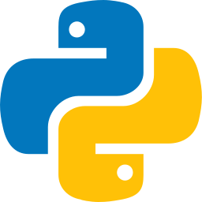
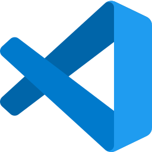

<h1 >Hi there , I'm Younes</h1>
<h3 >I am currently a Computer Science student at the Norwegian University of Science and Technology - NTNU.</h3>

  

- 🔥 I'm passionate about full-stack development and always interested in learning more and getting better at what I do. 

- 🌱 I’m currently diving into [The Odin Project](https://www.theodinproject.com/about) to strengthen my full-stack JavaScript development skills! Next, I'm excited to explore and integrate TypeScript into my projects.

- 🚀I'm into both technology and business, especially where they meet and the possibilities it creates.

- 🌐 Check out my [website](https://younesbb.github.io/HomeBase/) to see some of my projects!

- 📫 Don’t hesitate to get in touch if there are any exciting opportunities or projects!

<h3 ><strong>Today's developer quote:</strong></h3>

<h3 >Languages:</h3>

<h3 >Frontend:</h3>

<h3 >Backend:</h3>

<h3 >Databases:</h3>

<h3 >Infrastructure:</h3>

<h3 >Tools:</h3>

